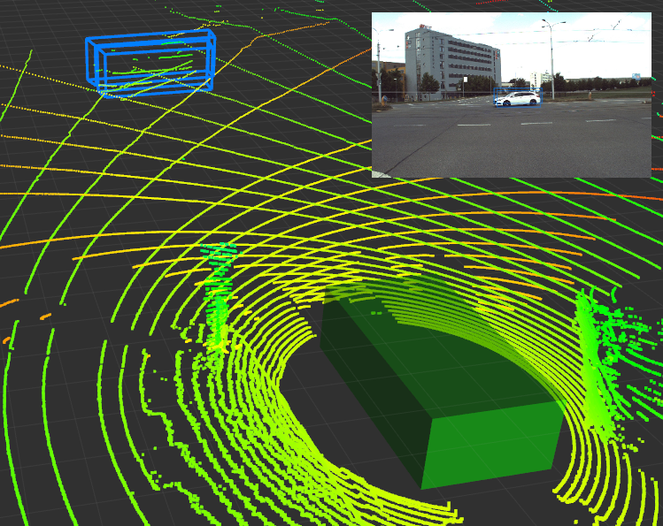
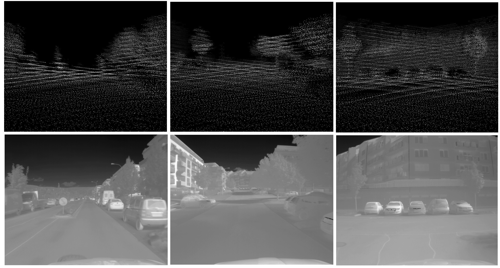

# Atlas Fusion

Project implements the Atlas Fusion local map algorithms.

[Adam Ligocki](https://www.vutbr.cz/en/people/adam-ligocki-154791#navigace-vizitka) · [Aleš Jelínek](https://www.ceitec.cz/ing-ales-jelinek-ph-d/u91705) · [Luděk Žalud](https://scholar.google.com/citations?user=kWXqPAIAAAAJ&hl=en&oi=ao)

## Prerequisites

[ROS](https://www.ros.org/) installed  
[Brno Urban Dataset](https://github.com/Robotics-BUT/Brno-Urban-Dataset) session downloaded  
[Docker](https://www.docker.com/) installed

## Environment preparation

In the ``dockerfile/`` folder you can find the dockerfile with the definition of the environment in which we are running this project. On the very bottom of the dockerfile there are three lines that build the image, setup environment and run the docker container. If you are not familiar with building and running docker containers, please see the (official documentation](https://docs.docker.com/engine/reference/commandline/build/).

## Compilation

Inside the docker container, enter the project's folder and run ``catkin_make``.

It is also recommended to open entire CMake project in the [CLion](https://www.jetbrains.com/clion/) IDE.

## Run

Run ``atlas_fusion <path_to_config_file>``, where the config file could be found in ``src\atlas_fusion`` folder.

## Brief Functionality Overview

For detail description, please see our [whitepaper](https://arxiv.org/abs/2010.11991).

The main feature of our framework is to build up the model of the surrounding of the autonomous agent and to detect and track objects in this map.

 
 

Framework is capable estimate the precise position of the agent and its sensors. This information is used to aggregate LiDAR data and increase point cloud density in this way.

 
 

Thanks to the point cloud 3D model of the surrounding, framework can estimate the distance of the objects detected by the neural networks in the camera images.

 
 

Example of reprojection of the NN's detections form RGB image into the thermal image.

 
 

One of the latest features is the projecting 3D point cloud model into the camera frame. In this way we are able to create depth maps (virtual depth cameras).

 
 

## Attribution

If you have used our data, please cite our original [paper](https://arxiv.org/abs/2010.11991)

## Acknowledgement

The research was supported by ECSEL JU under the project H2020 737469 AutoDrive - Advancing fail-aware, fail-safe, and fail-operational electronic components, systems, and architectures for fully automated driving to make future mobility safer, affordable, and end-user acceptable. This research has been financially supported by the Ministry of Education, Youth and Sports of the Czech republic under the project CEITEC 2020 (LQ1601).
